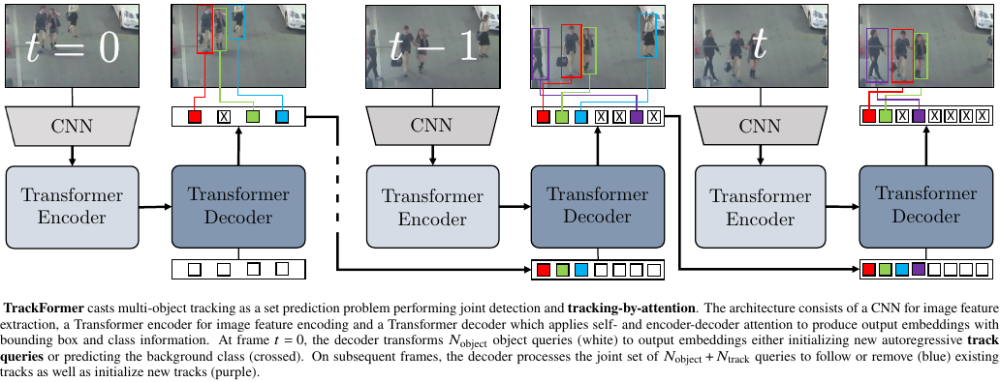

# TrackFormer: Multi-Object Tracking with Transformers

This repository uses the official implementation of the [TrackFormer: Multi-Object Tracking with Transformers](https://arxiv.org/abs/2101.02702) paper by [Tim Meinhardt](https://dvl.in.tum.de/team/meinhardt/). The codebase builds upon [DETR](https://github.com/facebookresearch/detr), [Tracktor](https://github.com/phil-bergmann/tracking_wo_bnw) and [VRWKV](https://github.com/OpenGVLab/Vision-RWKV).

<!-- **As the paper is still under submission this repository will continuously be updated and might at times not reflect the current state of the [arXiv paper](https://arxiv.org/abs/2012.01866).** -->

<div align="center">
    
    
</div>

## Abstract
 Object tracking, the task of identifying and following objects across video frames, remains a fundamental challenge in computer vision, with applications spanning autonomous navigation, surveillance, and human-computer interaction. 
 Existing transformer-based models, such as TrackFormer, rely on the Detection Transformer (DETR) framework, which applies global attention mechanisms to all image tokens, resulting in high computational costs and memory inefficiencies 
 that hinder real-time performance and scalability. To address these limitations, we explore the integration of the Receptance Weighted Key Value (RWKV) model—a state-of-the-art natural language processing architecture—into the multiple 
 object tracking paradigm. We propose a novel hybrid framework that combines the encoder structure of Vision-RWKV (VRWKV) with a TrackFormer-inspired decoder, enhancing both feature extraction and tracking performance. Unlike traditional 
 transformers that use quadratic attention, the VRWKV encoder employs a linear attention mechanism, significantly reducing memory consumption and computational complexity while maintaining expressive feature representations. 
 The TrackFormer-inspired decoder leverages attention based temporal modeling to ensure robust object tracking across frames. The proposed approach is evaluated on the MOT17 dataset, demonstrating significant improvements in tracking 
 efficiency and scalability compared to Trackformer. Our findings suggest that this hybrid architecture enables high-performance object tracking suitable for deployment in resource-constrained environments without compromising accuracy.

<div align="center">
    
</div>

## Installation

We refer to our [docs/INSTALL.md](docs/INSTALL.md) for detailed installation instructions.

## Train TrackFormer

We refer to our [docs/TRAIN.md](docs/TRAIN.md) for detailed training instructions.

## Evaluate TrackFormer

In order to evaluate TrackFormer on a multi-object tracking dataset, we provide the `src/track.py` script which supports several datasets and splits interchangle via the `dataset_name` argument (See `src/datasets/tracking/factory.py` for an overview of all datasets.) The default tracking configuration is specified in `cfgs/track.yaml`. To facilitate the reproducibility of our results, we provide evaluation metrics for both the train and test set.

### MOT17

#### Private detections

```
python src/track.py with reid
```

<center>

| MOT17     | MOTA         | IDF1           |       MT     |     ML     |     FP       |     FN              |  ID SW.      |
|  :---:    | :---:        |     :---:      |    :---:     | :---:      |    :---:     |   :---:             |  :---:       |
| **Train** |     74.2     |     71.7       |     849      | 177        |      7431    |      78057          |  1449        |
| **Test**  |     74.1     |     68.0       |    1113      | 246        |     34602    |     108777          |  2829        |

</center>

#### Public detections (DPM, FRCNN, SDP)

```
python src/track.py with \
    reid \
    tracker_cfg.public_detections=min_iou_0_5 \
    obj_detect_checkpoint_file=models/mot17_deformable_multi_frame/checkpoint_epoch_50.pth
```

<center>

| MOT17     | MOTA         | IDF1           |       MT     |     ML     |     FP       |     FN              |  ID SW.      |
|  :---:    | :---:        |     :---:      |    :---:     | :---:      |    :---:     |   :---:             |  :---:       |
| **Train** |     64.6     |     63.7       |    621       | 675        |     4827     |     111958          |  2556        |
| **Test**  |     62.3     |     57.6       |    688       | 638        |     16591    |     192123          |  4018        |

</center>


<div align="center">
    
</div>

## Publication
If you use this software in your research, please cite this publication:

```
@InProceedings{meinhardt2021trackformer,
    title={TrackFormer: Multi-Object Tracking with Transformers},
    author={Tim Meinhardt and Alexander Kirillov and Laura Leal-Taixe and Christoph Feichtenhofer},
    year={2022},
    month = {June},
    booktitle = {The IEEE Conference on Computer Vision and Pattern Recognition (CVPR)},
}
```
